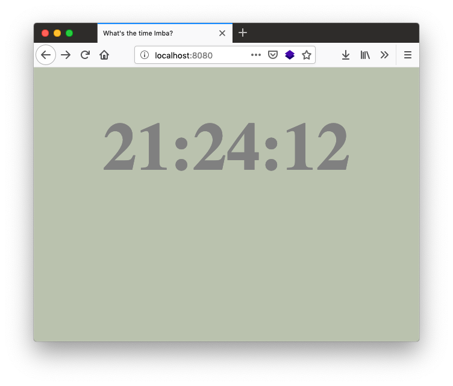

# What's the time Imba? [](https://app.netlify.com/sites/competent-bose-81d442/deploys)

This project is based on [What's the time?][0] but rewritten in [Imba][1].



## To use

```
yarn install
yarn run start
```

[0]: https://github.com/scanf/What-s-the-time-
[1]: http://imba.io/
